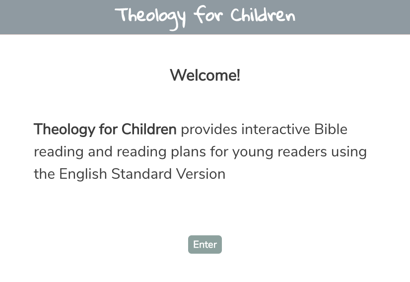
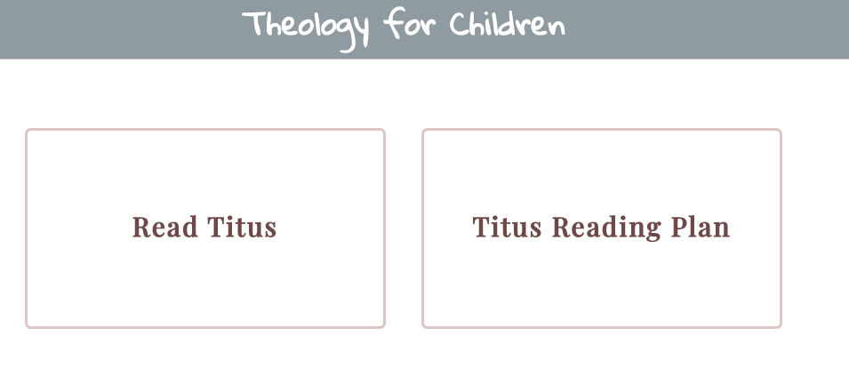
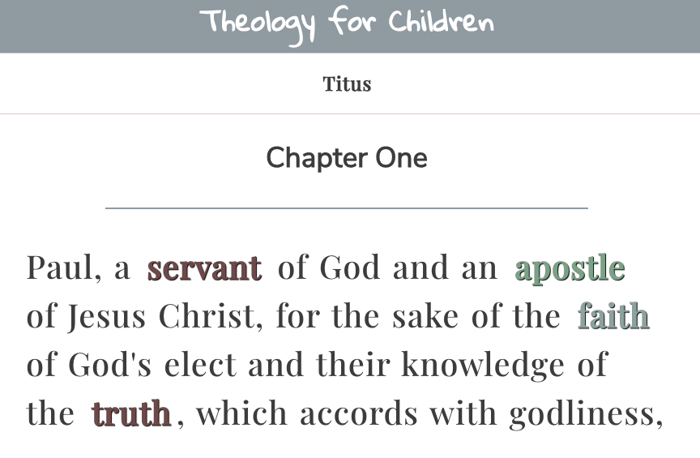
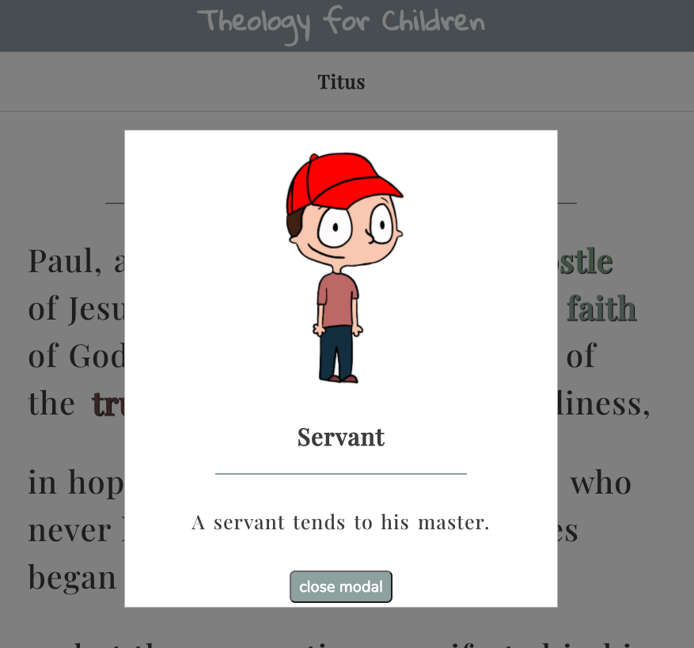
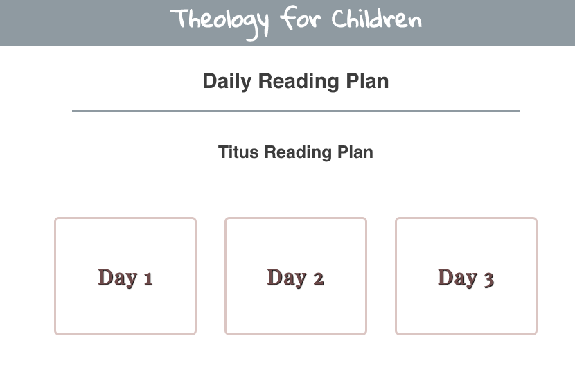
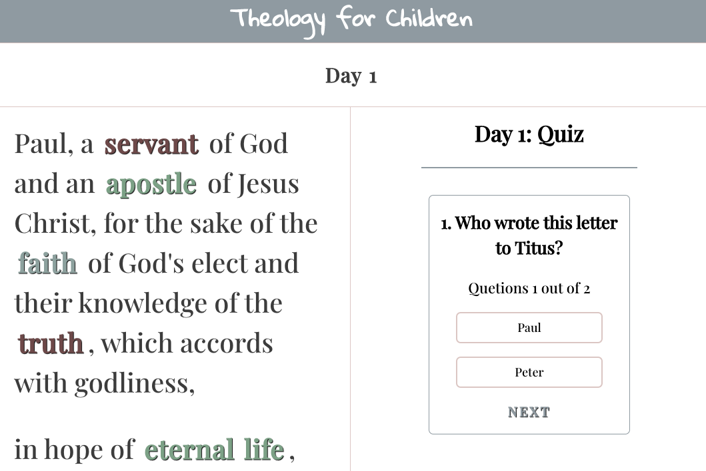

# Theology for Children App

Link to live app: https://theology-for-children-app.vercel.app/

## Screen Shots

Landing Page:

This page gives the user information about the app.

Home Page:

This page gives the user options between Free Read and Reading Plans.

Read Page:

This page gives the user the availability to read through the available content and interact with select words to learn more.

Interactive Page:

This page gives the user access to an image, as well as, information about the specific word clicked-on.

Reading Plan Page:

This page gives the user access different reading plans.

Reading Plan Screen Page:

This page provides selected reading plan, as well as, an interactive comprehensive reading quiz.

## Summary of App
This app is directed towards early readers and allows users to read and interact with specific words and quizes.

The app is divided into two sections: 1) Read and 2) Daily Reading Plan.

The Read section allows the user the availability to read through the available content and interact with select words to learn more. The interactive words gives access to an image, as well as, information about the specific word clicked-on.

The Daily Reading Plan section allows the user access different reading plans and provides an interactive comprehensive reading quiz.

## Technologies Used
React.js/JSX/Enzyme/Jest/HTML/CSS/JSON